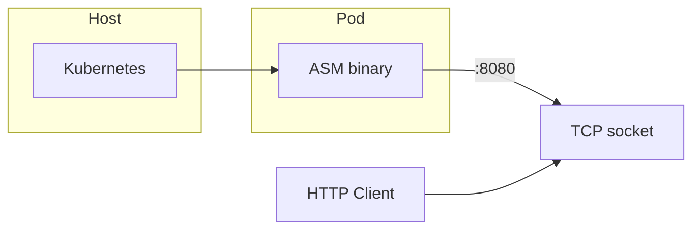

# Веб-сервис на ассемблере: Docker + Kubernetes

## Ограничения и выбор стека

- **Язык**: ассемблер под Linux (NASM для x86_64, GAS/ARM ASM для arm64).
- **HTTP**: без полноценного парсера — только разбор первой строки запроса (до `\r\n`) и сравнение с `GET / HTTP/1.x` и `GET /health HTTP/1.x`. Ответ — фиксированные строки с заголовками и телом.
- **Сеть**: системные вызовы Linux (socket, bind, listen, accept, read, write, close). Без libc — только ядро.
- **Репозиторий**: создаём с нуля.

Архитектура потока:

## 1. Структура проекта

- `src/` — исходники: x86_64 (main.asm, http.asm / syscalls), arm64 (main.S, http.S).
- `Dockerfile` — multi-stage, multi-arch (buildx).
- `docker-compose.yml` — для **локальной разработки и проверки**: поднимать сервис через `docker-compose up` и проверять, что `/` и `/health` отвечают.
- `k8s/` — Deployment, Service, при необходимости ConfigMap.

## 2. Логика сервера (x86_64)

- Точка входа: `_start` (без libc, `-nostdlib`, entry=`_start`).
- Socket (syscall) → bind на 0.0.0.0:PORT → listen → цикл: accept → read в буфер → по первым байтам маршрут GET / или GET /health → write ответа → close.
- Ответы: фиксированные байты в `.rodata` (HTTP/1.1 200 OK, Content-Type, Content-Length, тело) для каждого маршрута.

## 2.1. Маршруты

- **GET /health** — для проб K8s: ответ 200, `Content-Type: text/plain`, тело например `OK`. Без HTML.
- **GET /** — главная: **страница с описанием проекта**:
  - ссылка на репозиторий на GitHub;
  - размер бинарника (в байтах / KiB);
  - размер Docker-образа (в байтах / MiB).

Страница отдаётся как HTML (`Content-Type: text/html`), тело — фиксированный шаблон с плейсхолдерами под размеры и URL. Размеры и ссылка подставляются **на этапе сборки**: в ассемблере зарезервированы поля фиксированной длины (например, в .rodata), при сборке в Dockerfile:

- размер бинарника — из `stat`/`wc -c` после линковки, записать в бинарь (скрипт/printf в известные смещения или сгенерировать .inc и пересобрать);
- размер образа — через `ARG IMAGE_SIZE` (в CI: первый билд → `docker inspect` → второй билд с `--build-arg IMAGE_SIZE=...`), иначе подставить "N/A".
URL GitHub — константа в коде или тот же механизм подстановки при сборке.

## 3. ARM64 (multi-arch)

- Отдельные исходники под ARM64 (GAS, syscall через `svc #0`).
- Docker: buildx — образы для `linux/amd64` и `linux/arm64`.

## 4. Docker

- Базовый образ сборки: debian/ubuntu с nasm, binutils, (gcc для линкера).
- Multi-stage: сборка → **финальный образ обязательно `scratch`** (минимальный вес), один порт 8080, EXPOSE 8080.
- После линковки: скрипт/команда подставляет в бинарь размер бинарника (и при необходимости `ARG IMAGE_SIZE`, URL GitHub) для главной страницы.

## 5. Kubernetes

- **Deployment**: один контейнер, порт 8080.
- **Service**: ClusterIP (или NodePort/LoadBalancer), порт 8080.
- **Пробы**: livenessProbe и readinessProbe — httpGet на `:8080/health`.

## 6. Шаги

1. Добавить структуру каталогов и базовые файлы (src/, Dockerfile, docker-compose.yml, k8s/).
2. Реализовать x86_64: socket/bind/listen/accept, разбор первой строки, два ответа, цикл.
3. Собрать образ amd64 и **при разработке запускать через `docker-compose up`**, проверять вручную или скриптом: GET `/` и GET `/health` возвращают ожидаемое (статус 200, тело).
4. Добавить ARM64 и multi-arch в Dockerfile (buildx).
5. Применить манифесты K8s, проверить поды и доступ к `/` и `/health`.

**Проверка при разработке**: после изменений — `docker-compose up --build`, затем запросы (браузер или `curl`) на `http://localhost:8080/` и `http://localhost:8080/health`; убедиться, что всё работает перед коммитом/деплоем.

## 7. Риски и упрощения

- Ручной разбор HTTP и syscall в ASM объёмные; ограничиваемся первой строкой и двумя маршрутами.
- Без TLS; при необходимости — ингресс/прокси с терминацией TLS.
- Multi-arch: один Dockerfile с build-arg TARGETARCH и разными командами для amd64/arm64.
- **Scratch**: образ без ОС — только бинарь; линковка обязательно статическая (`-static`), иначе в scratch не запустится.

